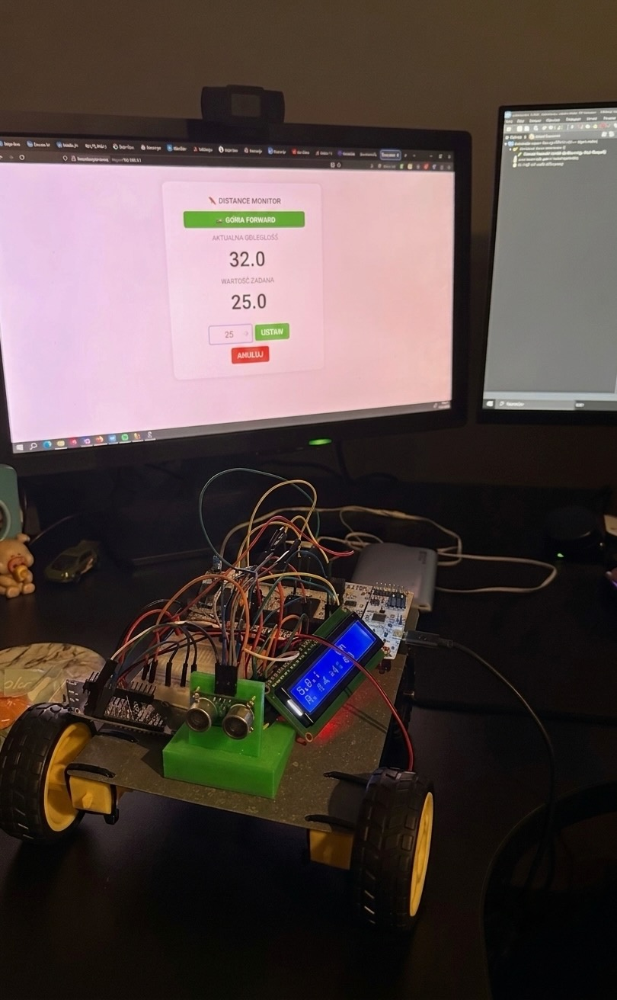
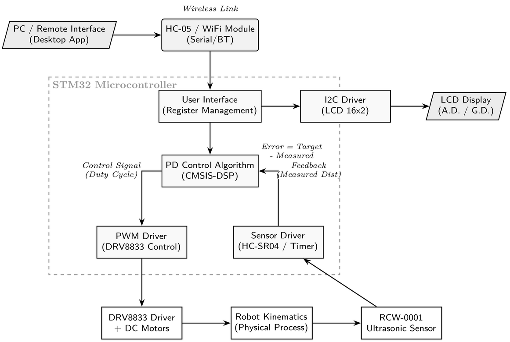
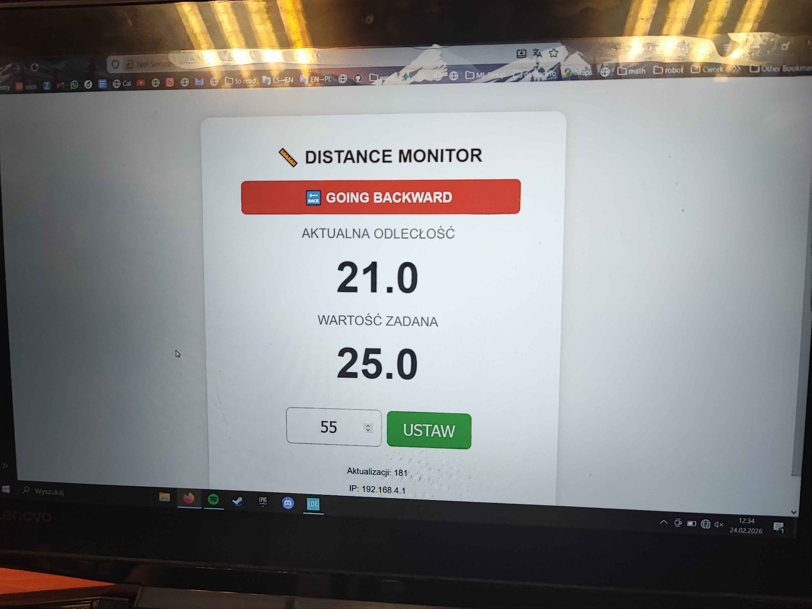

# 🤖 Object Oriented / Embedded Systems Project (C)

### Obstacle-Distance Self-Controlling Car

[](https://youtube.com/shorts/7Yi4cYmKdvI)
[](https://www.st.com/en/microcontrollers-microprocessors/stm32-32-bit-arm-cortex-mcus.html)
[](https://www.arduino.cc/)
[](https://www.st.com/en/evaluation-tools/nucleo-f411re.html)

A mobile robot that regulates its own distance from a wall using a closed-loop ultrasonic feedback controller. Built for the **Microprocessor Systems** course at **Poznań University of Technology**, Faculty of Control, Robotics and Electrical Engineering, together with Jakub Kaźmierczak and Jakub Krusicki.



## Demo

▶️ **[Watch on YouTube](https://youtube.com/shorts/7Yi4cYmKdvI)** — the car tracking a target distance live, with the web dashboard and LCD readout.

## How it works

An STM32 NUCLEO board reads distance from an ultrasonic sensor, runs a PD control loop against a target set-point, and drives two DC motors through an H-bridge to close the gap. Status is shown locally on an LCD and remotely on a live web dashboard served over the car's own WiFi access point.



```
RCW-0001 sensor → HC-SR04-style timer capture → PD controller → DRV8833 PWM → DC motors
                                     ↓                                          ↑
                              LCD (I2C, local)                     ESP8266 WiFi dashboard (remote)
```

## Live web dashboard

The ESP8266 hosts its own access point (`DistanceMonitor`) and web server — no router needed. It polls `/data` every 200 ms to show the live measured distance, the target set-point, and whether the car is currently driving forward, backward, or holding position, and lets you push a new target distance via `/set`.



## Hardware

| Component | Role |
|---|---|
| **STM32 NUCLEO board** | Main controller — sensor timing, PD control, motor PWM, LCD, UART bridge to WiFi |
| **RCW-0001 ultrasonic sensor** (HC-SR04-compatible) | Distance measurement, 1–450 cm range, 1 mm resolution |
| **DRV8833 dual H-bridge** (1.5 A, 10 V) | Drives the two DC motors |
| **2× DC gear motors** (1:48, 200 RPM, 3–6 V) | Drivetrain |
| **ESP8266 NodeMCU v3** | WiFi access point + web dashboard, serial bridge to the STM32 |
| **modHC-05 (FC-114)** | Secondary serial/Bluetooth link for monitoring & debugging |
| **16×2 LCD (I2C)** | Local readout of measured vs. target distance |
| **Buck converter (→6 V) + regulated 5 V supply** | Separate power rails for motors and MCU logic |
| **3×AA / 4×AA battery packs** | Power source |

## Firmware

Two independent codebases, bridged over UART:

- **[`firmware/esp8266_wifi_dashboard/`](firmware/esp8266_wifi_dashboard)** — complete Arduino sketch for the ESP8266: hosts the access point, serves the dashboard HTML/JS, exposes `/data` and `/set` endpoints, and relays the target/measured distance to and from the STM32 over serial.
- **[`firmware/stm32/`](firmware/stm32)** — STM32 HAL drivers and control logic: ultrasonic sensor timing, PD controller, motor control, LCD driver, and the ISR callbacks that tie them together. See [`firmware/stm32/README.md`](firmware/stm32/README.md) for a short layout/config reference.

### Control loop

```c
float Calculate_PD(PD_Controller *pd, uint32_t *current_distance)
{
    uint32_t now = HAL_GetTick();
    float dt = (now - pd->last_time) / 1000.0f;
    if (dt <= 0.0f) dt = 0.001f;

    float error = *current_distance - pd->target_distance;
    if (error > -TOLERANCE_CM && error < TOLERANCE_CM) {
        pd->prev_error = error;
        pd->last_time = now;
        return 0.0f;
    }

    float derivative = (error - pd->prev_error) / dt;
    float output = (pd->Kp * error) + (pd->Kd * derivative);

    pd->prev_error = error;
    pd->last_time = now;
    return output;
}
```

Runs every 50 ms; output is clamped to `[MIN_PWM, PWM_MAX]` and routed to the H-bridge, with polarity choosing forward/backward direction.

## Results

- **Steady-state error:** ~1 cm at a 20 cm target over a 450 cm sensor range → 0.22%, comfortably under the 1% requirement.
- **Direction detection / regulation:** stable closed-loop tracking with intuitive wireless monitoring and clear real-time visualization (LCD + web dashboard).

**Limitations:** sensor noise at very small distances, mechanical vibrations affecting readings.
**Possible improvements:** PID tuning, signal filtering, improved chassis alignment.

Full test methodology and additional-requirements writeup are in the [project report](docs/report/Obstacle_Distance_Car_Report.pdf).

## Repository structure

```
.
├── firmware/
│   ├── esp8266_wifi_dashboard/   # complete ESP8266 Arduino sketch (AP + dashboard + serial bridge)
│   └── stm32/                    # STM32 HAL drivers and control logic
├── docs/
│   ├── images/                   # vehicle photo, dashboard screenshot, architecture diagram
│   └── report/                   # full lab report (PDF)
└── README.md
```

## Authors

**Oskar Jabłonowski**, Jakub Kaźmierczak, Jakub Krusicki — Automatic Control and Robotics, Poznań University of Technology
Instructor: Teodor Krupski, M.Sc

## License

[MIT](LICENSE)
